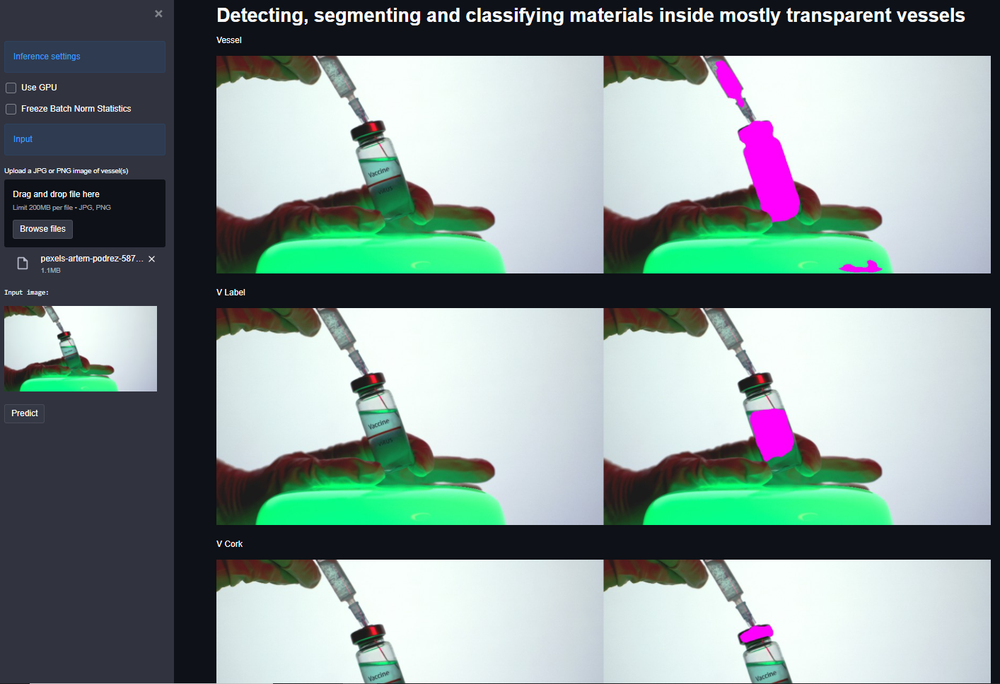

# streamlit-materials-segmentation-in-vessels
A [Streamlit](https://streamlit.io/) app for detecting, segmenting and classifying materials inside mostly transparent vessels in images using a fully convolutional neural network. Use case for this [paper](https://chemrxiv.org/articles/Computer_Vision_for_Recognition_of_Materials_and_Vessels_in_Chemistry_Lab_Settings_and_the_Vector-LabPics_Dataset/11930004) and inspired by [Sagi Eppel](https://scholar.google.co.il/citations?user=Ifl1aB0AAAAJ&hl=en)'s [implementation](https://github.com/virtualramblas/Detecting-and-segmenting-and-classifying-materials-inside-vessels-in-images-using-convolutional-net).  
The current release of the app allows predictions on single images only. Next releases will include predictions on a video or a directory of images or videos.  
  
## Setup for running the app
Anaconda and Python 3.7+ are required.  
1. Clone this repo. 
2. Download the pre-trained PyTorch model from [here](https://zenodo.org/record/3697767) or [here](https://drive.google.com/file/d/1wWGPoa7aKBlvml6Awe4AzJUbNlR72K6X/view?usp=sharing).
3. Extract the model weights (file *TrainedModelWeiht1m_steps_Semantic_TrainedWithLabPicsAndCOCO_AllSets.torch*) and copy it into the *model* directory. 
4. From the root folder of the project, create the conda virtual environment: *conda env create -f environment.yml*  
5. Activate the virtual environment: *conda activate streamlit-vessel-segmentation*  
6. Run the app: *streamlit run app.py*  
## Notes
- Both CPU and GPU are supported to run the predictions on single images. CPU is enough to execute with good performance.  
- The *app.py* script is the core Streamlit app and has been implemented by *virtualramblas*.
- The *CategoryDictionary.py* and *FCN_NetModel.py* scripts are the same as for the original implementation from Sagi Eppel. Their implementation for this project will change in the future.  

